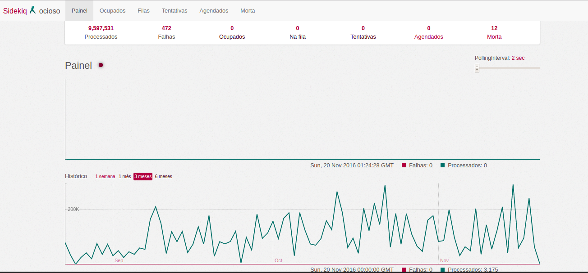

## Grrapi docs

---

### Sidekiq



No matter how big is your application, its better that you follow at least some kind of precaution before putting your code in production. This mean that is a really good idea to run all not necessarily processing in an async way, and this is way sidekiq exists \o/

By default, **all mailers and notifications are delivered async as background job** handled by Sidekiq.  
Beside this, all **origins** records are saved in database as background job too. You can read more about **record origins [here](#link)**.

You can configurate [Sidekiq WEB UI](https://github.com/mperham/sidekiq/wiki/Monitoring#web-ui) credentials in `config/application.yml`:

```
sidekiq_username: "your-sidekiq-user"
sidekiq_password: "your-sidekiq-password"
```

To configure sidekiq, see `config/sidekiq.yml` who provides the basic configurations for running without problems.

---

### Next

See [Deployment](./whats_included-deployment.md)
